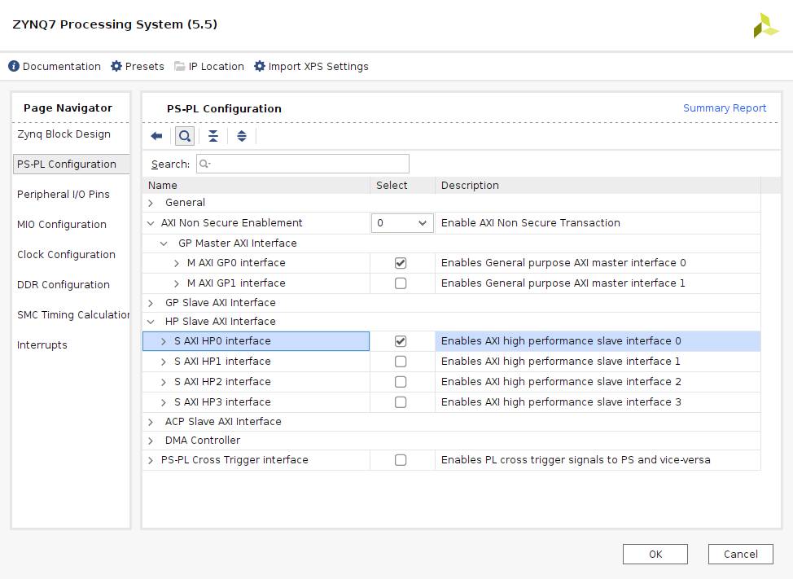

# AXI DMA in simple mode, by interrupts

> Last update: Vivado/Vitis 2021.2


## Vivado project creation

* Launch Vivado.
* *Quick start* -> *Create Project*.
  * *Next* in the splash screen.
  * Select a Project *name* and *location*, *Next*.
  * Select *RTL Proyect* and *Do not specify sources at this time*, *Next*.
  * Select your desired device/board (**Zybo**, **ZCU102**, other), *Next*.
  * *Finish* in the summary screen.

## Block design creation

* For a supported board, go to the *Tcl Console* and run `source <REPO_ROOT>/axidma/interrupts/interrupts_<BOARD>.tcl`.
* If your board is not supported, or if you want to create it from scratch, proceed with the instructions for the desired device family.

Instructions for `Zynq-7000` devices:
* *Create Block Design*, *OK* (default values).
* Click `+` (*Add IP*), search `zynq` and select `ZYNQ7 Processing System`.
* Click *Run Block Automation*, check *Apply Board Preset*, *OK*.
* Double click on *processing_system7_0*.
  * *PS-PL Configuration*:
    * *AXI Non Secure Enablement* -> *GP Master AXI Interface* -> *M_AXI_GP0 interface* should be checked.
    * Check *HP Slave AXI Interface* -> *S_AXI_HP0 interface*.
  * *Peripheral I/O Pins*:
    * Verify that at least one UART is configured (which is normally true if you specified a board).
    * Optionally, uncheck other interfaces.
  * *Interrupts*:
    * Check *Fabric Interrupts*.
    * Check *PL-PS Interrupt Ports* -> *IRQ_F2P[15:0*.
  * *OK* to finish, *OK* after validation.
* Click `+` (*Add IP*), search `axi dma` and select `AXI Direct Memory Access`.
* Double click on *axi_dma_0*.
  * Uncheck *Enable Scatter Gather Engine*.
  * Increase *Width of Buffer Length Register* to 26 bits.
  * *OK*.
* Click `+` (*Add IP*), search `fifo` and select `AXI4-Stream Data FIFO`.
* Click `+` (*Add IP*), search `concat` and select `Concat`.
* Perform the following manual connections:
  * *M_AXIS_MM2S* output (DMA) to *S_AXIS* input (FIFO).
  * *M_AXIS* output (FIFO) to *S_AXIS_S2MM* input (DMA).
  * *mm2s_introut* output (DMA) to *In0* input (Concat).
  * *s2mm_introut* output (DMA) to *In1* input (Concat).
  * *dout* output (Concat) to *IRQ_F2P* input (Zynq).
* Click *Run Connection Automation*, select *All Automation* and click *OK*.
* Click *Run Connection Automation*, select *All Automation* and click *OK*.
* Click *Validate design* (F6), *OK*.
* **Optional:** click on *Regenerate Layout*.

Instructions for `Zynq-UltraScale+` devices:
 * Coming soon...


*Zynq-7000 PS-PL configuration*


*Zynq-7000 Interrupts configuration*


*Zynq-7000 AXI-DMA configuration*


*Zynq-7000 block design*

## Bitstream generation, export and launch Vitis

* Right click on *Sources* -> *Design Sources* -> *design_1*
* Select *Create HDL wrapper*, *Let Vivado manage wrapper and auto-update*, *OK*.
* Click on *Generate Bitstream*, *Yes* (launch synthesis and implementation), *OK*.
* Wait for *Bitstream Generation successfully completed*, and *Cancel* (don't open implemented design).
* *File* -> *Export* -> *Export Hardware*. *Next*.
* Select *include bitstream*. *Next*.
* Select where to export and *Next*, then *Finish*.
* *Tools* -> *Launch Vitis IDE*.

## Vitis project creation

* *Select a directory as workspace*, *Launch*.
* *File* -> *New* -> *Application Project*.
* *Next* in the splash screen.
* Got to *Create a new platform hardware (XSA)*, *Browse*.
* Find the previously exported `design_1_wrapper.xsa`, select it and *Open*, *Next*.
* Specify an *Application project name* (`interrupts` for example), *Next*.
* *Next* on the Domain screen.
* Select the *Empty Application (C)* template, *Finish*.
* Right click on *<YOUR_APP_NAME>_system* -> *<YOUR_APP_NAME>* -> *src* and select *Import sources*.
* Browse *<REPO_ROOT>/axidma/interrupts*, *Open*.
* Check `interrupts.c`.
* **Optional:** click *Advanced*, check *create links on workspace*.
* *Finish*.

## Build and run

* Right click on *<YOUR_APP_NAME>_system* -> *<YOUR_APP_NAME>*, select *Build project*.
* Connect and energize your board (configured for JTAG programming).
* Configure a serial terminal at 115200 (ex: `screen /dev/ttyUSB1 115200`).
* Right click on *<YOUR_APP_NAME>_system* -> *<YOUR_APP_NAME>*, select *Run As* -> *Launch Hardware*.
* Verify the output of the serial terminal:
```C
* DMA Simple Mode by Interrupt Example
* Initializing DMA
INFO: Device configured in Simple Mode.
* Initializing Interrupts
* Playing with DMA
Try 1
INFO: TX interrupt!
INFO: RX interrupt!
Try 1 passed
Try 2
INFO: TX interrupt!
INFO: RX interrupt!
Try 2 passed
Try 3
INFO: TX interrupt!
INFO: RX interrupt!
Try 3 passed
Try 4
INFO: TX interrupt!
INFO: RX interrupt!
Try 4 passed
Try 5
INFO: TX interrupt!
INFO: RX interrupt!
Try 5 passed
Try 6
INFO: TX interrupt!
INFO: RX interrupt!
Try 6 passed
Try 7
INFO: TX interrupt!
INFO: RX interrupt!
Try 7 passed
Try 8
INFO: TX interrupt!
INFO: RX interrupt!
Try 8 passed
Try 9
INFO: TX interrupt!
INFO: RX interrupt!
Try 9 passed
Try 10
INFO: TX interrupt!
INFO: RX interrupt!
Try 10 passed
* Example Passed
```
