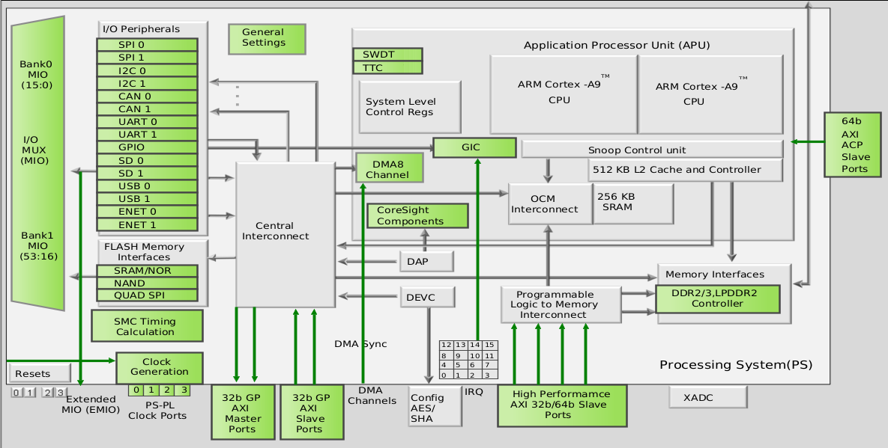

# Zynq 7000 Overview

> See the [Zynq-7000 Technical Reference Manual (UG585)](https://www.xilinx.com/support/documentation/user_guides/ug585-Zynq-7000-TRM.pdf) for details.

*Zynq-7000 block diagram*

The Zynq-7000 family integrates a dual or single-core Arm Cortex-A9 MPCore (r3p0) based processing system (PS) and programmable logic (PL) in a single device, built on a 28 nm process technology.

## Programmable Logic

The PL is derived from Xilinx 7 series FPGA technology (Artix for 7z020 and lower, Kintex for 7z030 and upper), and includes resources such as:
* Configurable Logic Blocks (CLBs), based on LUT6.
* Port and width configurable 36 Kb BRAM (configurable as dual 18 Kb).
* DSP slices with a 25 x 18 multiplier, 48-bit accumulator and pre-adder.
* A user configurable analog to digital convertor (XADC).
  * Dual 12-bit 1 MSPS ADCs.
* A configuration block with 256b AES for decryption and SHA for authentication.
* Configurable SelectIO technology.
  * High range (HR) I/Os support 1.2V to 3.3V.
  * High performance (HP) I/Os support 1.2V to 1.8V (only in Kintex based devices).
* Multi-gigabit transceivers.
  * GTX (up to 12.5 Gb/s) in Kintex based devices.
  * GTP (up to 6.25 Gb/s) in 7z012s and 7z015 devices.
  * **Note:** no transceivers in other devices.
* Integrated PCIe block (7z015 and Kintex based devices).
  * Supports Gen1 (2.5 Gb/s) and Gen2 (5.0 Gb/s) speeds.

## Processor System

### Application Processor Unit (APU)

* Single processor, asymmetrical or symmetrical multiprocessing configurations.
* 32 KB I and 32 KB D L1 caches per core.
* 512 KB of shareable L2 cache.
* 256 KB og on-chip SRAM (OCM), accesible by the CPUs, PL and central interconnect.
* DMA controller (ARM PL330, r1p1):
  * Four channels for PS (memory copy to/from any memory in system)
  ° Four channels for PL (memory to PL, PL to memory)

### Memory Interfaces

* DDR Controller (DDR3, DDR3L, DDR2, LPDDR-2).
* Quad-SPI Controller, which can be a primary boot device.
* Static Memory Controller (SMC), NAND and SRAM/NOR, which can be a primary boot device.

### I/O peripherals

**Note:** the controller registers require single 32-bit read/write accesses, do not use byte, halfword, or double word references.

* GPIO:
  * Up to 54 signals for device pins routed through the Multiplexed IO (MIO), 3-state capable.
  * 192 signals between PS and PL via the Extended MIO (EMIO): 64 inputs, 64 outputs, 64 output enables.
  * MIO is split into two voltage domains (1.8, 2.5/3.3 volts): bank 0 for pins 0:15, bank 1 for pins 16:53.
* 2 x Gigabit Ethernet Controllers.
  * RGMII (MIO), SGMII (PL GTP or GTX), others (PL and external PHY).
* 2 x USB 2.0 Controllers (Host, Device or OTG).
* 2 x SD/SDIO 2.0 Controllers (optional bootable SD Card mode).
* 2 x SPI Controllers (Master or Slave).
  * 50 MHz through MIO, 25 MHz through EMIO.
* 2 x CAN Controllers.
  * Up to 1 Mb/s.
* 2 x UART Controllers.
* 2 x I2C (spec v2) Controllers.

### PS-PL interfaces

* AXI interfaces.
* EMIO.
* Interrupts:
  * 28 from the I/O peripherals to the PL.
  * 20 from the PL to the PS, where 16 are connected to the General Interrupt Controller (GIC).
* DMA flow control.
* 4 x clocks / 4 x resets.
* Debug interfaces.

## AXI interfaces

> All the AXI interfaces are based on the AXI 3.0 Standard.

* 4 x AXI_HP (High Performance) Interfaces
  * PL master, PS slave.
  * High bandwidth datapaths to the DDR and OCM memories.
  * 32/64-bits wide (independently programmed per port).
  * **Note:** HP0/HP1 share one internal switch, while HP2/HP3 share another one, so if two HP ports are needed, use HP0/2 or HP1/3.
* 1 x AXI_ACP (Accelerator Coherency Port) Interface.
  * PL master, PS slave.
  * Low-latency access to the Snoop Control Unit (SCU), to access L2 cache and OCM.
  * 64-bits wide.
  * **Note:** from a system perspective, the ACP interface has similar connectivity as the APU CPUs.
* 4 x AXI_GP (General purpose) Interfaces.
  * 2 x 32-bit master interfaces.
    * The DMAC interface to the PL is through this interfaces.
  * 2 x 32-bit slave interfaces.

## Connectivity

Mst \ Slv    | OCM | DDR Port 0 | DDR Port 1 | DDR Port 2 | DDR Port 3 | M_AXI_GP | AHB Slaves | APB Slaves
---           |---  |---         |---         |---         |---         |---       |---         |---
CPUs          | X   | X          |            |            |            | X        | X          | X
AXI_ACP       | X   | X          |            |            |            | X        | X          | X
AXI_HP{0,1}   | X   |            |            |            | X          |          |            |
AXI_HP{2,3}   | X   |            |            | X          |            |          |            |
S_AXI_GP{0,1} | X   |            | X          |            |            | X        | X          | X
DMAC          | X   |            | X          |            |            | X        | X          | X
AHB Masters   | X   |            | X          |            |            | X        | X          | X

## Address Map

Address Range              | Bytes    | CPUs & ACP  | AXI_HP | Other masters | Notes
---                        |---       |---          |---     |---            |---
`0000_0000` to `0003_FFFF` | 256 KB   | OCM         | OCM    | OCM           | Address not filtered by SCU and OCM is mapped low
same range than above      |          | DDR         | OCM    | OCM           | Address filtered by SCU and OCM is mapped low
same range than above      |          | DDR         |        |               | Address filtered by SCU and OCM is not mapped low
same range than above      |          |             |        |               | Address not filtered by SCU and OCM is not mapped low
`0004_0000` to `0007_FFFF` | 256 KB   | DDR         |        |               | Address filtered by SCU
same range than above      |          |             |        |               | Address not filtered by SCU
`0008_0000` to `000F_FFFF` | 512 KB   | DDR         | DDR    | DDR           | Address filtered by SCU
same range than above      |          |             | DDR    | DDR           | Address not filtered by SCU
`0010_0000` to `3FFF_FFFF` | 1023 MB  | DDR         | DDR    | DDR           | Accessible to all interconnect masters
`4000_0000` to `7FFF_FFFF` | 1024 MB  | PL          |        | PL            | M_AXI_GP0
`8000_0000` to `BFFF_FFFF` | 1024 MB  | PL          |        | PL            | M_AXI_GP1
`C000_0000` to `DFFF_FFFF` | 512 MB   |             |        |               | Nothing
`E000_0000` to `FDFF_FFFF` | 480 MB   | REGS & MEMS |        | REGS & MEMS   | Registers and memories (QSPI, SMC)
`FE00_0000` to `FFFB_FFFF` | 31.75 MB |             |        |               | Nothing
`FFFC_0000` to `FFFF_FFFF` | 256 KB   | OCM         | OCM    | OCM           | OCM is mapped high
same range than above      |          |             |        |               | OCM is not mapped high

* **Note:** other masters include S_AXI_GP interfaces and the DMAC.
