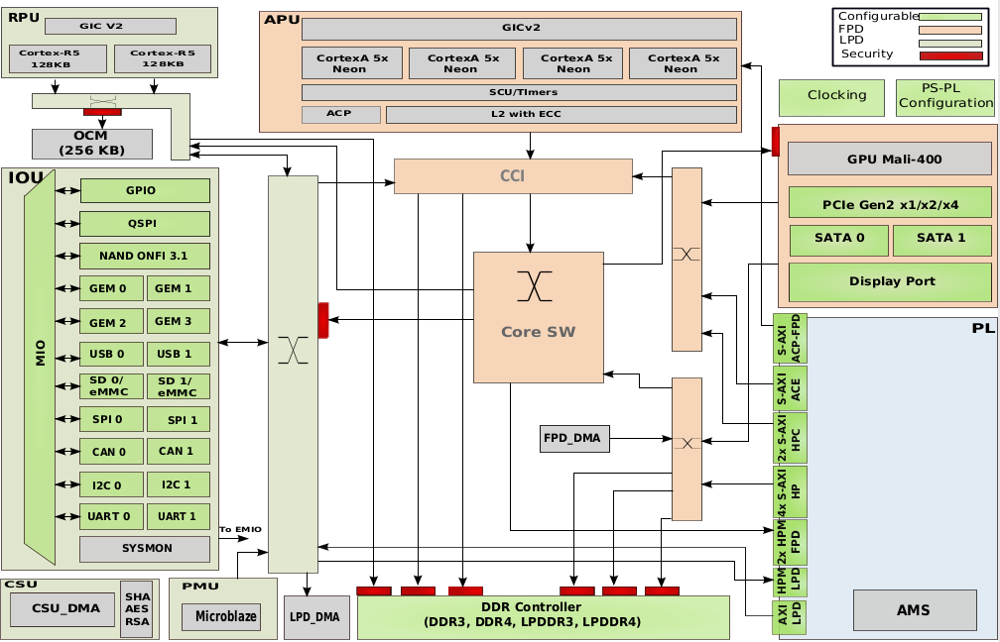

# Zynq UltraScale+ Overview

> See the [Zynq UltraScale+ Device Technical Reference Manual (UG1085)](https://www.xilinx.com/support/documentation/user_guides/ug1085-zynq-ultrascale-trm.pdf) for details.

> I copied/adapted content from a great public course from [CERN](https://ohwr.org/project/soc-course/wikis/home), basically from [here](https://ohwr.org/project/soc-course/wikis/MPSoC-Architecture-Overview) and [here](https://ohwr.org/project/soc-course/wikis/MPSoC-Address-Map).

*Zynq UltraScale+ block diagram*

Zynq UltraScale+ MPSoC is the Xilinx second-generation Zynq platform, combining a powerful processing system (PS) and user-programmable logic (PL) into the same device, built on a 16 nm process technology.
The processing system features a quad or dual-core Cortex A53 and a dual-core Cortex-R5F real-time processor.

## Processing Units

In the MPSoC, there are two main blocks with different specialized processing units:

**Processing System (PS):**
* APU: Quad or Dual core Cortex-A53 (r0p4-50rel0) application processing unit. ARM v8 64-bit architecture. It supports:
  * Asymmetric Multi Processing (AMP): each core running different applications (limited support due to shared HW infrastructure).
  * Symmetric Multi Processing (SMP): all of the cores running the same software (e.g. Linux operating system).
* RPU: Dual core Cortex-R5F (r1p3) real-time processing unit. ARM v7 32-bit architecture.
  * Split Mode: each core running different applications as totally independent CPUs.
  * Lockstep Mode: both cores running the same application for higher security.
* PMU: Platform management unit based on triple module redundant Microblaze processor.
* CSU: Configuration Security Unit based on triple module redundant Microblaze processor.
* GPU: MALI-400 graphic processing unit (available in EG and EV MPSoC families).

**Programmable Logic (PL):**
* VCU: Video control unit with hardware codecs and compression (available in EV MPSoC family).
* RF: Radio frequency unit with up to 16 channels RF-ADCs and RF-DACs (available in RFSoC family).
* CLBs (based on LUT6), BRAM, UltraRAM and DSPs.
* Configurable SelectIO technology.
  * High density (HD) I/Os.
  * High performance (HP) I/Os.
* Multi-gigabit transceivers.
  * GTY (up to 32.75 Gb/s).
  * GTH (up to 16.375 Gb/s).
  * **Note:** there are also PS-GTR (up to 6 Gb/s).
* PCI v3.1
* 100 Gb/s Ethernet.
* 150 Gb/s Interlaken v1.2.

### Power Management

The power management in the MPSoC is handled by the Platform Management Unit (PMU).

There are four different power domains:
* Low Power Domain (LPD): RPU, PMU, CSU, LPD_DMA, and LPD peripherals
* Full Power Domain (FPD): APU, FPD_DMA, and FPD peripherals
* PL Power Domain (PLPD): Programmable logic
* Battery Power Domain (BPD): Real Time clock and Battery-backed RAM (BBRAM) for secure configuration key.

Each power domain can be individually isolated. The platform management unit (PMU) on the LPD facilitates the isolation of each of the power domains. Additionally, the isolation can be turned on automatically when one of the power supplies of the corresponding power domain is accidentally powered down. Since each power domain can be individually isolated, functional isolation (an important aspect of safety and security applications) is possible.

* **Note:** because the PS and PL resides in two different power domains, the Processing System can be used as a full-featured SoC without powering up the Programmable Logic.

The MPSoC supports three different operational power modes:
* Battery Powered Mode: maintain critical information over the time when MPSoC is powered-off.
* Low Power Mode: only the devices in the LPD are powered up.
* Full Power Mode: all the power domains are activated, including Programmable Logic.

### I/O peripherals

**Low Power Domain (LPD):**
* General Purpose I/O (GPIO)
* Quad SPI Flash Memory (QSPI)
* NAND ONFI 3.1 Controller.
* 4x Gigabit Ethernet MAC
* 2x USB3
* 2x Secure Digital IO (SDIO) for SD / eMMC.
* 2x Serial Peripheral Interface (SPI).
* 2x CAN
* 2x I2C
* 2x UART
* System Monitor

**Full Power Domain (FPD):**
* PCIe Gen2 x1/x2/x4
* 2x Serial Advanced Technology Attachment (SATA)
* 2x Display Port 1.2 (DP)

**Programmable Logic Power Domain (PLPD):**
* PCIe Gen3 x16, Gen4 x8.
* 100G Ethernet.
* 150G Interlaken v1.2.
* GTH and GTY Transceivers.

The peripheral's I/O interfaces can be router to the Multiplexed I/O (MIO) and the Extended Multiplexed I/O (EMIO).
* There are up to 78 MIO ports divided in three banks available from the processing system and the MIO itself resides in the Low Power Domain.
* As the number of MIO ports is limited, many of the available peripherals can be routed to the programmable logic through EMIO.

### PS-PL interfaces

* AXI interfaces.
* EMIO.
* 16 shared interrupts and four inter-processor interrupts.
* 4 x clocks / ? x resets.
* 2 x DMAC (Northwest Logic, 1.13):
  * FPD DMA: 128-bit AXI data interface, 4 KB command buffer, non-coherent with CCI (Coherent Interconnect).
  * LPD DMA: 64-bit AXI data interface, 2 KB command buffer, I/O coherent with CCI.
  * **Note:** each instantiation has 8 channels.

## AXI interfaces

**PS master / PL slave:**
* 3 x PS General Purpose Master interfaces (32, 64, and 128 bits width, default 128)
  * 2 x M_AXI_HPM[0:1]_FPD: FPD masters to PL slaves
  * 1 x M_AXI_HPM0_LPD: LPD masters to PL slaves (low latency from peripherals and RPU)

**PL master / PS slave:**
* 7 x PS Slave interfaces (32, 64, and 128 bits width, default 128):
  * 4 x S_AXI_HP[0:3]_FPD: non-coherent paths from PL to FPD main switch and DDR
  * 2 x S_AXI_HPC[0:1]_FPD: I/O coherent with CCI (128-bits only)
  * 1 x SAXI_LPD: non-coherent path from PL to IOP in LPD
* 1 x S_AXI_ACE_FPD: two-way coherent path between memory in PL and CCI (128-bits)
* 1 x S_AXI_ACP_FPD: legacy coherency, I/O coherent with L2 cache allocation (128-bits)

## Address Map

The global address map is composed of multiple inclusive address maps, depending on the address width of the interface master.
The maximum physical address is 40 bits.

**32-Bit (4 GB) Address Map**

The lower 4 GB in the address map allow access to all of the devices inside the MPSoC:
* LPD and FPD peripherals
* PCIe Low
* Quad-SPI
* DDR Low
* LPD domain memories
* Programmable Logic
  * M_AXI_HPM0_FPD
  * M_AXI_HPM1_FPD
  * M_AXI_HPM0_LPD

This aperture to all the devices from the lower 32-bit is due to:
* Software compatibility with previous SoC generations (Zynq-7000).
* Allowing access to all devices from both Cortex-A53 (64 bit) and Cortex-R5 (32 bit).

**36-Bit (64 GB) Address Map**

This is a superset of the 32-Bit Address Map. Address space beyond 4 GB is used by:

* Programmable Logic (8 GB):
  * M_AXI_HPM0_FPD (4 GB)
  * M_AXI_HPM1_FPD (4 GB)
* PCIe High (8 GB)
* DDR High (32 GB)

**40-Bit (1 TB) Address Map**

This is a superset of the 32-Bit Address Map. It spans the complete physical address space (40 bits). Address space beyond 64 GB is used by:

* Programmable Logic (64 GB):
  * M_AXI_HPM0_FPD (224 GB)
  * M_AXI_HPM1_FPD (224 GB)
* PCIe High (256 GB)
* Reserved Space (256 GB)

Address Range                    | Bytes  | Slave name
---                              |---     |---
`0000_0000` to `7FFF_FFFF`       | 2 GB   | DDR Low
`8000_0000` to `9FFF_FFFF`       | 512 MB | M_AXI_HPM0_LPD (LPD_PL)
`A000_0000` to `A3FF_FFFF`       | 64 MB  | VCU
`A400_0000` to `AFFF_FFFF`       | 192 MB | M_AXI_HPM0_FPD (HPM0) interface
`B000_0000` to `BFFF_FFFF`       | 256 MB | M_AXI_HPM1_FPD (HPM1) interface
`C000_0000` to `DFFF_FFFF`       | 512 MB | Quad-SPI
`E000_0000` to `EFFF_FFFF`       | 256 MB | PCIe Low
`F000_0000` to `F7FF_FFFF`       | 128 MB | Reserved
`F800_0000` to `F8FF_FFFF`       | 16 MB  | STM CoreSight
`F900_0000` to `F90F_FFFF`       | 1 MB   | APU GIC
`F910_0000` to `FCFF_FFFF`       | 63 MB  | Reserved
`FD00_0000` to `FDFF_FFFF`       | 16 MB  | FPD slaves
`FE00_0000` to `FEFF_FFFF`       | 16 MB  | Upper LPD slaves
`FF00_0000` to `FFBF_FFFF`       | 12 MB  | Lower LPD slaves
`FFC0_0000` to `FFFF_FFFF`       | 4 MB   | CSU, PMU, TCM, OCM
`01_0000_0000` to `03_FFFF_FFFF` | 12 GB  | Reserved
`04_0000_0000` to `04_FFFF_FFFF` | 4 GB   | M_AXI_HPM0_FPD (HPM0)
`05_0000_0000` to `05_FFFF_FFFF` | 4 GB   | M_AXI_HPM1_FPD (HPM1)
`06_0000_0000` to `07_FFFF_FFFF` | 8 GB   | PCIe High
`08_0000_0000` to `0F_FFFF_FFFF` | 32 GB  | DDR High
`10_0000_0000` to `47_FFFF_FFFF` | 224 GB | M_AXI_HPM0_FPD (HPM0)
`48_0000_0000` to `7F_FFFF_FFFF` | 224 GB | M_AXI_HPM1_FPD (HPM1) 
`80_0000_0000` to `BF_FFFF_FFFF` | 256 GB | PCIe High
`C0_0000_0000` to `FF_FFFF_FFFF` | 256 GB | Reserved

**Note:** the VCU is mapped by the design tools to the 64 MB address space listed in the table, but it can be configured to another address within an M_AXI_HPMx_FPD address range. If VCU is not mapped, the M_AXI_HPM0_FPD interface has a 256 MB range.
