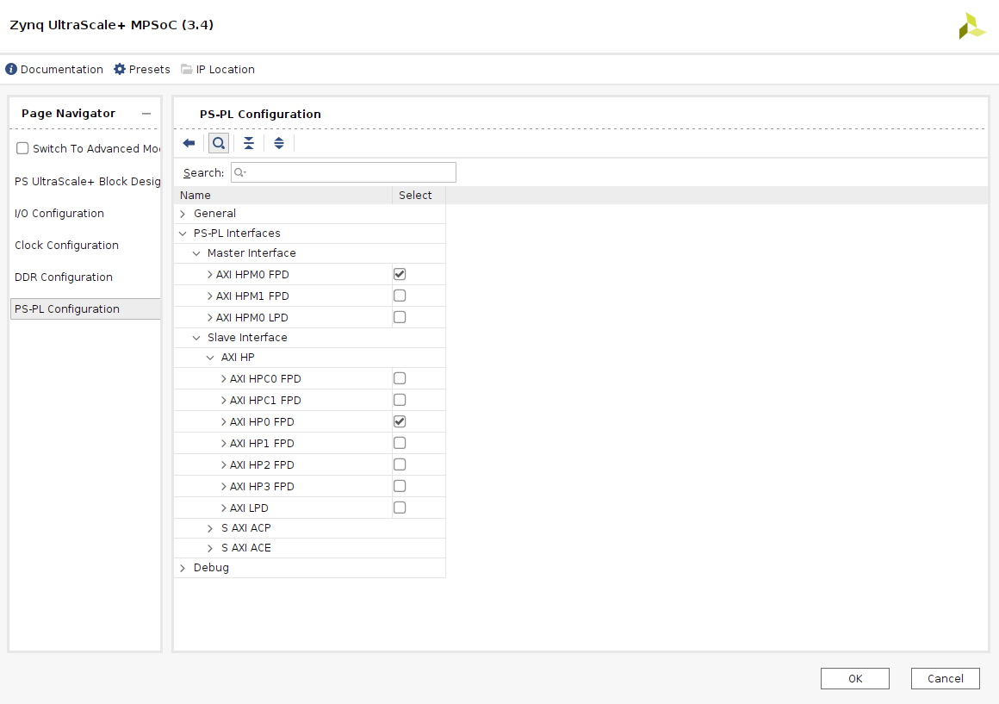
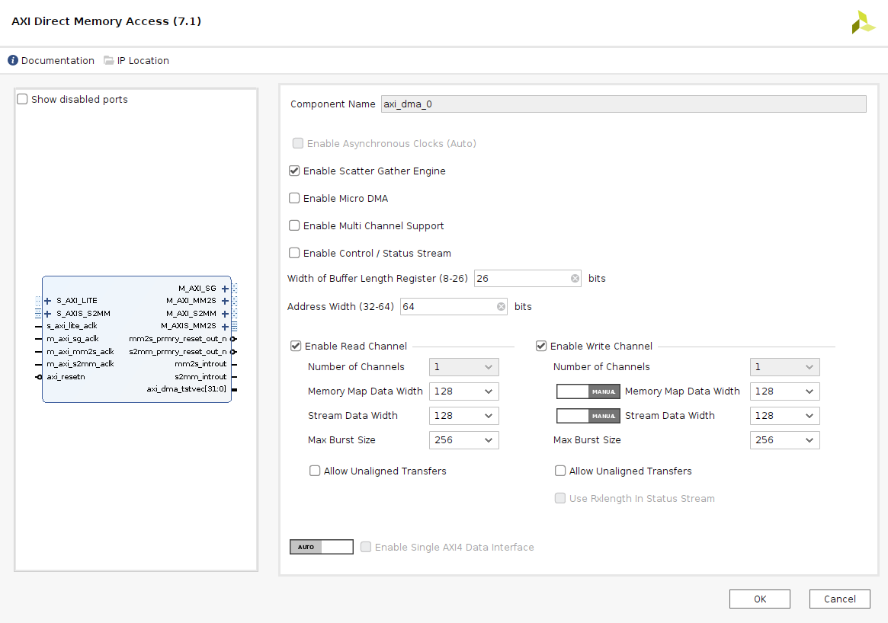
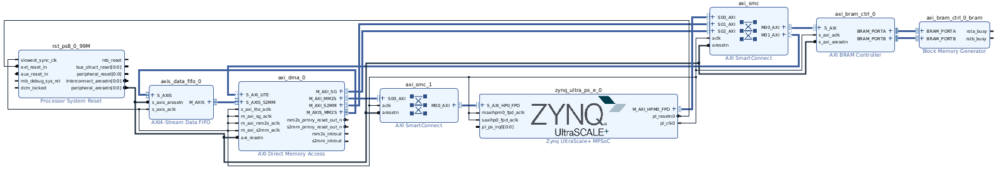

# Petalinux

> Last update: Vivado/Petalinux 2022.1

## Resources

* [Linux DMA From User Space 2.0](https://xilinx-wiki.atlassian.net/wiki/spaces/A/pages/1027702787/Linux+DMA+From+User+Space+2.0)

## Vivado

* Launch Vivado.
* *Quick start* -> *Create Project*.
  * *Next* in the splash screen.
  * Select a Project *name* and *location*, *Next*.
  * Select *RTL Proyect* and *Do not specify sources at this time*, *Next*.
  * Select your desired device/board (**Zybo**, **ZCU102**, other), *Next*.
  * *Finish* in the summary screen.

* For a supported board, go to the *Tcl Console* and run `source <REPO_ROOT>/petalinux/<BOARD>.tcl`.
* If your board is not supported, or if you want to create it from scratch, proceed with the instructions for the desired device family.

Instructions for `Zynq-7000` devices:
* Not available.

Instructions for `Zynq-UltraScale+` devices:
* *Create Block Design*, *OK* (default values).
* Click `+` (*Add IP*), search `zynq` and select `ZYNQ UltraScale+ MPSoC`.
* Click *Run Block Automation*, check *Apply Board Preset*, *OK*.
* Double click on *zynq_ultra_ps_e*.
  * *PS-PL Configuration*:
    * *PS-PL interfaces*
      * *Master Interface* -> *AXI HPM0 FPD* should be checked (uncheck others).
      * *Slave Interface* -> *AXI HP0 FPD* should be checked (uncheck others).
  * *OK* to finish.
* Click `+` (*Add IP*), search `axi dma` and select `AXI Direct Memory Access`.
* Double click on *axi_dma_0*.
  * Uncheck *Enable Control/Status Stream*.
  * Increase *Width of Buffer Length Register* to 26 bits.
  * Increase *Address Width* to 64 bits.
  * Increase *Data Width* to 128 bits and *Max Burst Size* to 256.
  * *OK*.
* Click `+` (*Add IP*), search `fifo` and select `AXI4-Stream Data FIFO`.
* Perform the following manual connections:
  * *M_AXIS_MM2S* output (DMA) to *S_AXIS* input (FIFO).
  * *M_AXIS* output (FIFO) to *S_AXIS_S2MM* input (DMA).
* Click `+` (*Add IP*), search `bram` and select `AXI BRAM Controller`.
* Click *Run Connection Automation*, select *All Automation* and click *OK*.
* Click *Run Connection Automation*, select *All Automation* and click *OK*.
* Click *Validate design* (F6), *OK*.
* **Optional:** click on *Regenerate Layout*.

*Zynq UltraScale+ MPSoC PS-PL configuration*

*AXI-DMA configuration*

*Project block design*

* Right click on (*Hierarchy) *Sources* -> *Design Sources* -> *design_1*
* Select *Create HDL wrapper*, *Let Vivado manage wrapper and auto-update*, *OK*.
* Click on *Generate Bitstream*, *Yes* (launch synthesis and implementation), *OK*.
* Wait for *Bitstream Generation successfully completed*, and *Cancel* (don't open implemented design).
* *File* -> *Export* -> *Export Hardware*. *Next*.
* Select *include bitstream*. *Next*.
* Select where to export and *Next*, then *Finish*.

## Petalinux

* Prepare petalinux environment: `source /<LOCATION>/settings.sh`
* Create a project: `petalinux-create -t project -s <BOARD>.bsp -n <NAME>`
* Enter to the created project: `cd <NAME>`
* Initialize the project with HW info: `petalinux-config --get-hw-description=<EXPORTED_VIVADO_PROJECT>.xsa`, then `Exit`

* Create a custom application: `petalinux-create -t apps --template c --name dmatest --enable`
* Download `dmatest.c` from [here](https://support.xilinx.com/s/article/1223569) and replace `project-spec/meta-user/recipes-apps/dmatest/files/dmatest.c`
* Re-build the whole project: `petalinux-build`
